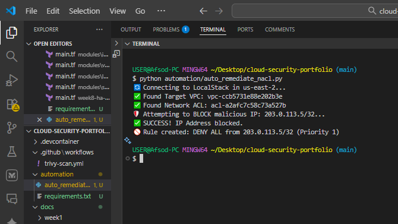

#  Security Automation (SOAR)
**Status:** ✅ Tested & Functional

## 1. Overview
This module demonstrates **Security Orchestration, Automation, and Response (SOAR)** capabilities. It moves beyond manual incident response by using Python and the AWS SDK (`boto3`) to programmatically remediate security threats in real-time.

**Objective:** Reduce Time-to-Remediation (TTR) from minutes (manual) to milliseconds (automated).

## 2. The Tool: `auto_remediate_nacl.py`
A Python utility that automatically blocks malicious IP addresses at the subnet level.

### Logic Flow
1.  **Authenticate:** Connects to the AWS environment (LocalStack) using `boto3`.
2.  **Discovery:** Dynamically queries the VPC API to find the active Network ACL (NACL).
3.  **Remediation:** Injects a `Rule #1` (Highest Priority) **DENY** entry for the target IP.

## 3. Usage
**Prerequisites:**
* Python 3.x installed
* `boto3` library installed (`pip install -r requirements.txt`)
* Active AWS/LocalStack session

**Execution:**
```bash
python auto_remediate_nacl.py

## 4. Artifacts
* **Source Code:** [auto_remediate_nacl.py](./auto_remediate_nacl.py)
* **Execution Evidence:**
    *(Screenshot showing successful connection to LocalStack and NACL rule creation)*
    

## Production Architecture (Planned)
While this lab runs the script locally, in a production environment, the workflow would be automated:
1.  **GuardDuty** detects a threat (Finding).
2.  **EventBridge** filters for "High Severity" findings.
3.  **Lambda** triggers this Python script, passing the Malicious IP as an input variable.
4.  **NACL** is updated to block the IP.

