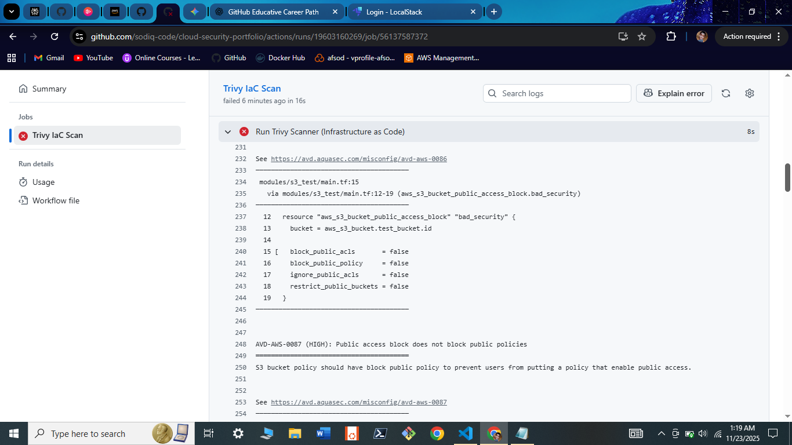
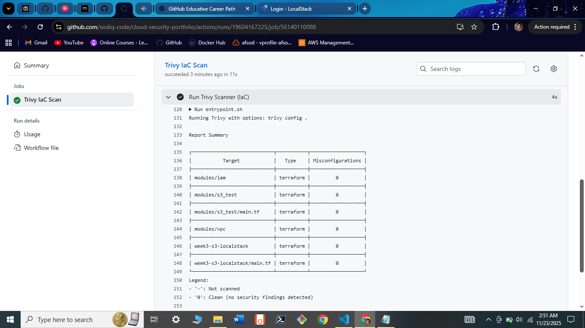

#  Week 4: DevSecOps & Automated Security Guardrails
**Status:** ✅ Pipeline Active & Validated

## 1. Objective
To implement **"Shift Left"** security by automating vulnerability scanning within the CI/CD pipeline.
This project moves security from a manual "gate" at the end of deployment to an automated check that happens on every single code commit.

## 2. The Solution: GitHub Actions + Trivy
I built a CI/CD workflow that automatically scans all Terraform Infrastructure as Code (IaC) for misconfigurations before they can be merged.

### The Pipeline Logic
* **Source:** [`.github/workflows/trivy-scan.yml`](../../.github/workflows/trivy-scan.yml)
* **Trigger:** Runs on every `push` or `pull_request` to the main branch.
* **Scanner:** Uses `aquasecurity/trivy-action` to parse Terraform files.
* **Enforcement:** Fails the build (Exit Code 1) if **HIGH** or **CRITICAL** issues are found.

## 3. Evidence of "Shift Left" in Action

### 🔴 Phase 1: The Failure (Detection)
I intentionally committed insecure code (a public S3 bucket with no encryption) to test the guardrail.
* **Result:** The pipeline **FAILED** and blocked the deployment.
* **Finding:** `AVD-AWS-0086` (S3 Bucket has public access block disabled).
* **Proof:**
    

### 🟢 Phase 2: The Fix (Remediation)
I remediated the code by:
1.  Enabling `aws_s3_bucket_public_access_block` (blocking public ACLs).
2.  Enabling `aws_s3_bucket_server_side_encryption_configuration` (AES-256).
* **Result:** The pipeline **PASSED**.
* **Proof:**
    

## 4. Key Learnings
* **Automated Governance:** Security policy is defined as code, ensuring consistent enforcement.
* **Cost Savings:** Catching misconfigurations in the pipeline costs $0 compare to potential data breach fines in production.