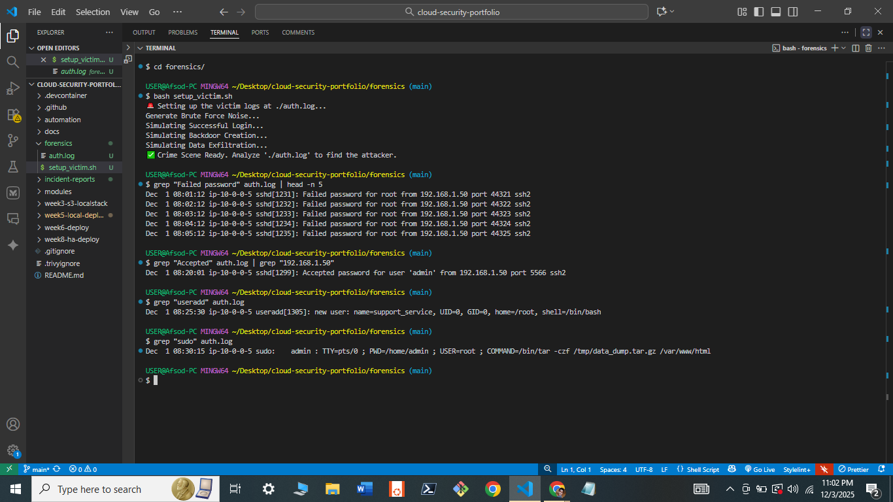

#  Digital Forensics & Incident Response (DFIR)
**Status:** ✅ Investigation Complete

## 1. Overview
This module simulates a **Compromised Linux Server** scenario to demonstrate forensic investigation skills. It focuses on identifying Indicators of Compromise (IoCs) from raw system logs rather than relying solely on dashboard alerts.

**Scenario:** A web server has been breached via SSH Brute Force.
**Goal:** Identify the attacker, the method of entry, and the post-compromise activity.

## 2. The Simulation (`setup_victim.sh`)
I wrote a Bash script to generate a realistic "Crime Scene" by injecting fake log entries into `auth.log`.
* **Attack Vectors Simulated:**
    * SSH Brute Force (Noise)
    * Successful Unauthorized Login (Breach)
    * Privilege Escalation (`sudo` abuse)
    * Persistence (Backdoor User Creation)

## 3. Investigation & Findings
Using Linux CLI tools (`grep`, `awk`, `tail`), I reconstructed the attack timeline.

| Phase | Evidence Found | Command Used |
| :--- | :--- | :--- |
| **Initial Access** | 15+ Failed Login attempts from IP `192.168.1.50` | `grep "Failed password" auth.log` |
| **Breach** | Successful login for user `admin` at 08:20:01 | `grep "Accepted" auth.log` |
| **Persistence** | Creation of backdoor user `support_service` (UID 0) | `grep "useradd" auth.log` |
| **Exfiltration** | Data compression command via `sudo` | `grep "sudo" auth.log` |

## 4. Artifacts
* **Incident Report:** [View Full Report](../incident-reports/incident-001.md)
* **Evidence Screenshot:**
