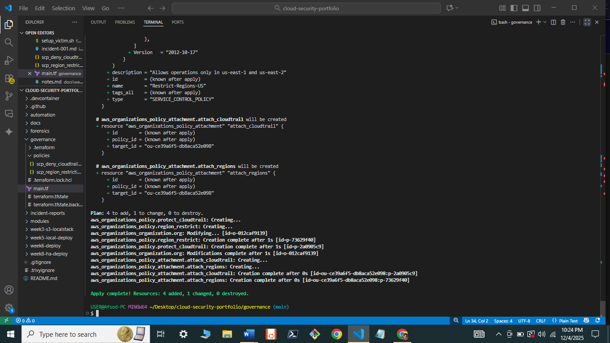

#  Project B: Enterprise Governance & Compliance
**Status:** ✅ Policies Enforced

## 1. Overview
This project demonstrates **Governance at Scale**. Instead of securing one account manually, I used **AWS Organizations** and **Service Control Policies (SCPs)** to enforce immutable security rules across an entire simulated enterprise organization.

**Business Goal:** Eliminate "Shadow IT" and ensure regulatory compliance (Data Residency, Log Integrity) automatically.

## 2. The Policies (The "Laws")

### 🛑 Policy A: Log Integrity (Anti-Tamper)
* **File:** [`scp_deny_cloudtrail_stop.json`](./policies/scp_deny_cloudtrail_stop.json)
* **Rule:** Explicitly `DENY` actions like `StopLogging` or `DeleteTrail`.
* **Effect:** Even a Root user in a member account cannot turn off auditing to hide their tracks.

### 🌎 Policy B: Data Sovereignty (Region Lock)
* **File:** [`scp_region_restriction.json`](./policies/scp_region_restriction.json)
* **Rule:** `DENY` all API calls to regions outside of `us-east-1` and `us-east-2`.
* **Effect:** Prevents accidental deployment of expensive resources in unapproved regions (e.g., sa-east-1).

## 3. Organization Structure
* **Root** (Management)
    * **Ou: Security-Prod** (Log Archives - Less Restrictive)
    * **Ou: Workloads-Prod** (Apps - **SCPs Applied Here**)

## 4. Deployment
Deployed via Terraform to LocalStack (Pro) with the `organizations` service enabled.

