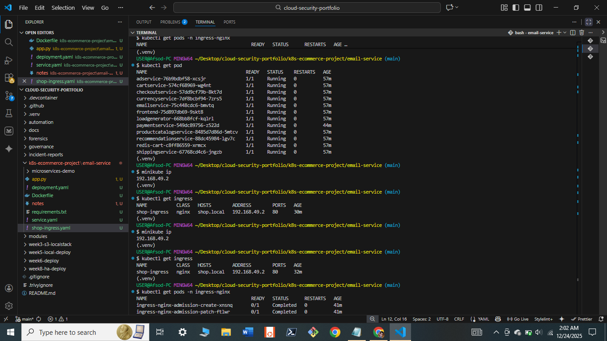
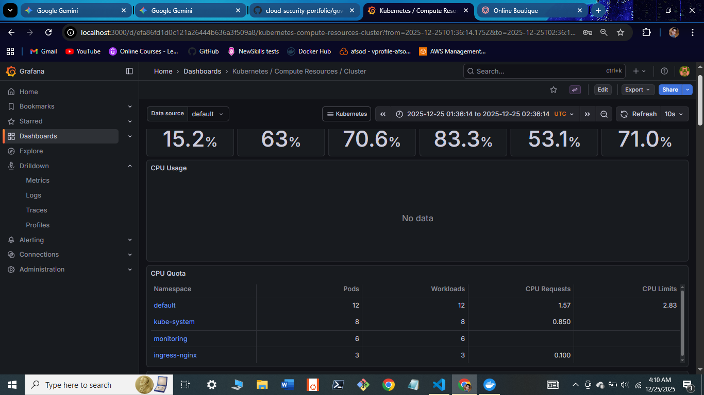
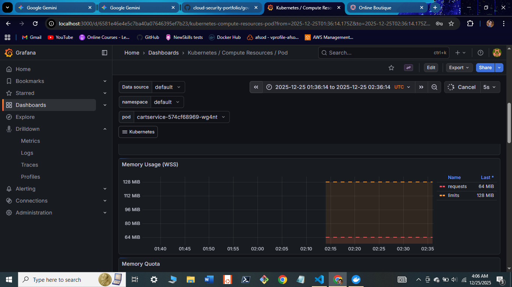

# Enterprise Microservices Orchestration on Kubernetes

> *Figure 1: The deployed Google Online Boutique application accessible via `shop.local` through the Nginx Ingress Controller.*

## 1. Project Overview
I architected and deployed a cloud-native e-commerce platform consisting of **11 polyglot microservices** (Go, C#, Node.js, Python). This project demonstrates a production-grade Kubernetes environment featuring self-healing infrastructure, Layer 7 Ingress routing, and full-stack SRE observability.

---

## 2. System Architecture
The application is composed of loosely coupled microservices communicating via gRPC. 

### Microservices Map

> *Figure 2: Service-to-Service communication map. The Frontend (public) talks to backend services like Checkout and Payment, while Redis handles state.*

### Self-Healing Design
I utilized Kubernetes **Deployments** and **ReplicaSets** to ensure high availability. The Controller Manager actively monitors the state of pods, automatically restarting any service that fails to match the declarative YAML blueprint.

> *Figure 3: The Kubernetes Control Loop ensuring the "Desired State" always matches the "Actual State."*

---

## 3. Networking & Traffic Flow
Instead of using basic `NodePort` or `port-forwarding`, I implemented an **Ingress-based architecture** to simulate a real-world edge router.

### Traffic Flow Diagram

> *Figure 4: Ingress Traffic Flow. Requests to `shop.local` are routed by the Nginx Controller to the correct ClusterIP service based on Host Headers.*

### Verification
Below is the terminal proof of the Ingress Controller managing the routing rules and the backend pods in a healthy state.

---

## 4. SRE Observability (Prometheus & Grafana)
To ensure reliability, I deployed the **kube-prometheus-stack** via Helm. This provides real-time visibility into the cluster's "Golden Signals" (Latency, Traffic, Errors, Saturation).

### Cluster Health Dashboard

> *Figure 5: High-level cluster metrics tracking CPU/Memory pressure across all nodes.*

### Pod-Level Diagnostics
I set up granular monitoring to track memory usage per pod, allowing for proactive detection of memory leaks or OOMKill events (e.g., in the `cartservice`).

## Technical Stack
- **Orchestration:** Kubernetes (Pods, Deployments, Services, Namespaces)
- **Ingress:** Nginx Ingress Controller (Layer 7 Routing)
- **IaC & Tooling:** Terraform, Helm, Docker
- **Observability:** Prometheus & Grafana (Golden Signals Monitoring)
- **Language:** Python (Email Service automation)

## Key Engineering Achievements
- **Self-Healing Infrastructure:** Configured ReplicaSets to ensure 99.9% availability; tested by simulating service failures and observing automated recovery.
- **Traffic Management:** Implemented an Ingress Gateway to handle name-based virtual hosting (`shop.local`), moving away from port-forwarding to a production entry-point model.
- **Full-Stack Observability:** Deployed a Prometheus/Grafana stack via Helm to monitor cluster health, specifically tracking Latency, Errors, and Saturation.
- **Microservices Communication:** Managed internal Service Discovery using ClusterIP, allowing services in Go, Node.js, and Python to communicate seamlessly.

---
*Author: Jimoh Sodiq*
*Link to Project: [Your GitHub Link]*

